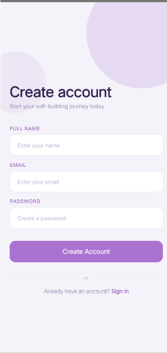
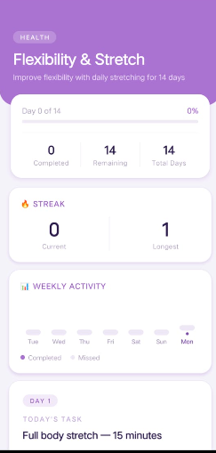
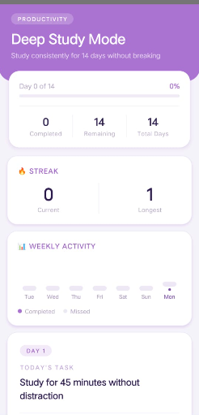
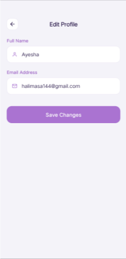

# SelfBuilder 🚀

**SelfBuilder** is a personal development mobile app built as a Final Year Project, designed to help users build better habits through structured challenges, daily task tracking, streaks, and community-driven motivation.

---

## 📱 About the Project

SelfBuilder helps users take control of their personal growth by enrolling in structured **challenges** across multiple categories, completing **daily tasks**, tracking **streaks**, earning **badges**, and competing on a **leaderboard** with other users. The app also supports **premium challenges** with integrated payment options tailored for local users.

This project was developed as a Final Year Project for a Software Engineering degree, covering the full software development lifecycle — from requirements and estimation (COCOMO) to design, implementation, and testing.

---

## ✨ Key Features

- 🎯 **Challenge Enrollment** — Browse and join challenges across multiple categories
- ✅ **Daily Task Tracking** — Log daily progress for each active challenge
- 🔥 **Streak System** — Stay motivated by maintaining consistency streaks
- 🏆 **Leaderboard** — Compete with other users based on progress and points
- 🎖️ **Badges** — Unlock achievement badges as milestones are reached
- 👤 **Profile & Settings** — Manage personal information and preferences
- 💳 **Premium Challenges** — Unlock exclusive challenges via:
  - Easypaisa
  - JazzCash
  - Card Payment
  - Bank Transfer

---

## 🛠️ Tech Stack

**Frontend**
- React Native (CLI, not Expo)
- NativeWind (Tailwind CSS for React Native)
- TypeScript / JavaScript

**Backend**
- Node.js
- Express.js (MVC architecture)
- MongoDB Atlas (Mongoose ODM)

---

## 📸 Screenshots

### Authentication
| Sign In | Create Account |
|---|---|
|  |  |

### Home & Challenges
| Explore Challenges | My Challenges |
|---|---|
|  |  |

### Challenge Tracking
| Health Challenge | Productivity Challenge |
|---|---|
|  |  |

Each challenge screen shows day-by-day progress, current streak, weekly activity, and today's task.

### Leaderboard

Users are ranked by completed challenges and active streaks, with category-based filters (Productivity, Mindset, Health).

### Profile
| Profile | Edit Profile |
|---|---|
|  |  |

---

## 🎓 Final Year Project

This project was developed and estimated using industry-standard software engineering practices, including COCOMO effort estimation and Agile development methodology, as part of a Software Engineering degree program.

---

## 👩‍💻 Author

**Halima**
GitHub: [@Halima144](https://github.com/Halima144)

---

## 📄 License

This project is developed for academic purposes as part of a Final Year Project.
